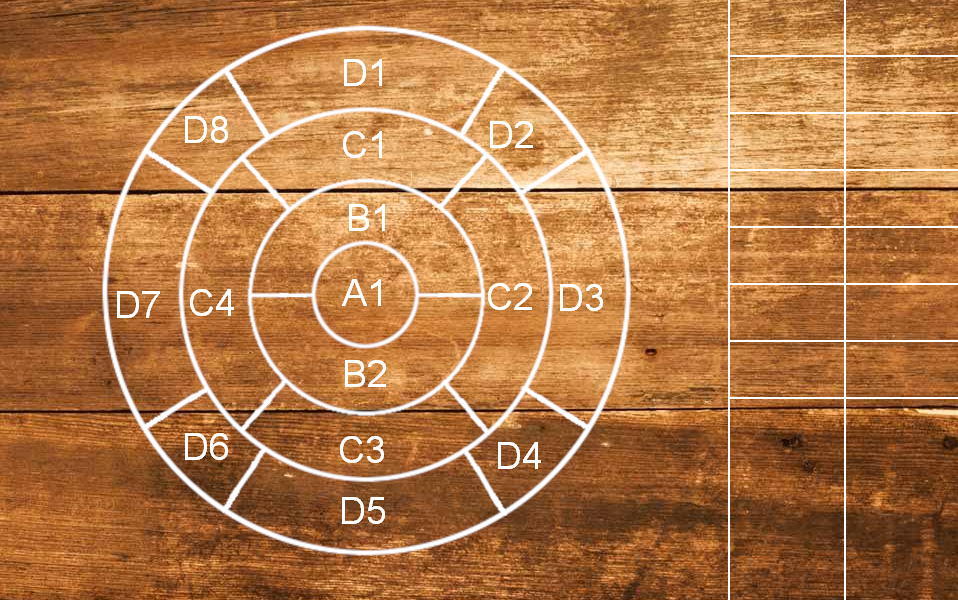
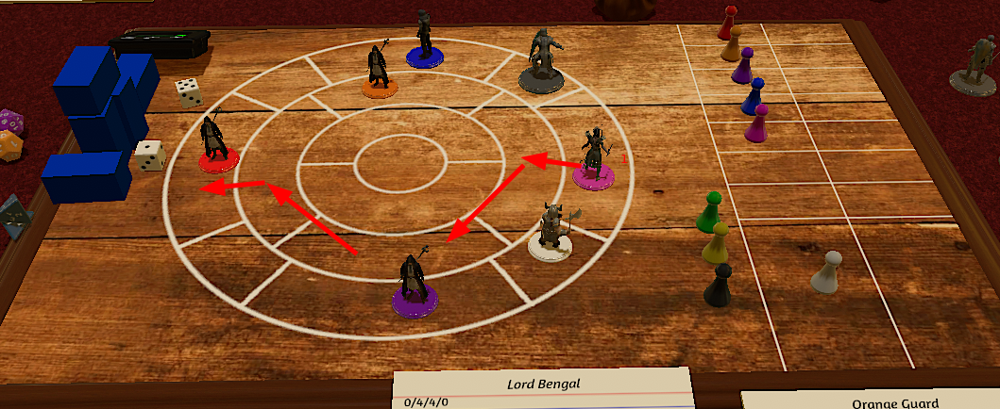

\thispagestyle{fancy}\protect

# How to Play
This is the core rulebook for Words of Power. Everything needed to join a game should be contained within. Examples of what to expect from a Storyteller should also be included. However, direct advice for running a game exists in a different tome. 

This tabletop roleplaying game will differ from some others that you may be used to. It will provide only a framework of rules, through which you may resolve narrative conflicts. It will not provide recourse against the Storyteller or a huge list of options from which to choose. This framework must be understood and applied in real-time by the Storyteller.

This game has been designed to reduce unnecessary prep work and moment-to-moment referencing. The goal is to cut through all the busy work and get right to the meat of roleplaying awesome characters in unique worlds.

# 1. Concepts
Before we can dig in to making a meaningful character, we need to understand a few major concepts in depth. You should always start with an awesome RP idea and then apply the rules to translate it. Do not let this book limit the story you want to tell.

Note: "Fate Weavers" refers to the lore of the game, which is not included in this document. The general idea is that some people are born with the ability to hold and manipulate the fates of both generic concepts (Fire, Sword, Cart) and specific fates (Astra of the Shadehill Guard). They use their mastery over these things to rewrite those portions of reality. Sometimes this is an overt magical effect (throwing fireballs) and other times it's more subtle (jumping a little higher). 

Normal people are unaware of the changes. Other Fate Weavers can sense such things. Fate Weavers use Specific Fates to avoid their own deaths. As a result, they live a long, long time and tend to have wide-reaching machinations. Players, bosses, and major story characters tend to be Fate Weavers. This can and should be reflavored to fit your particular setting.

## Language-Based
Words of Power is described as a "language-based" tabletop roleplaying game. What that means is that instead of crunching numbers or poring over obscure rules, we focus on language, context, and interpersonal skills to overcome challenges. When leveling up, you'll be choosing words to further describe your character. This is a stark contrast to most games, where you would gain abilities or stats. 

Words and relating them to the current context is the skill of Words of Power. Any of the rules that call for "a word" are referring to either Tags or Words of Power. In either case, these are literal language words that your party has generated. There is no index, appendix, or table that is going to give them concrete meaning. It's up to you and the Storyteller to understand how and when they apply. When in doubt, let the Storyteller make a ruling and keep the game moving.

## The Deck
The "Deck" is the collection of words that is built at the start of each session. Each player should submit 5-10 words to the Storyteller, who will aggregate and approve. This document assumes that words are submitted on individual index cards and then shuffled. Any method of collecting and randomizing will do.  

If you submit a word that's a homonym, such as "lead", be sure to specify which one you mean. Players (and enemy Fate Weavers) will draw from the Deck any time they fully succeed at a Skill Check or land the killing blow on an enemy. When the Deck is emptied, take a moment to have everyone generate additional words.

## Tags
Tags are words that describe something's qualities. Your character may have a Tag of [Resourceful], [Greedy], [Strong], [Big], [Small], or [Creepy]. Tags are passive and are not consumed upon providing their bonus. They can come from many sources and are considered available as long as the source is available. Faction, character creation, level-ups, armor, and magic items are the most common sources of Tags.

Your Storyteller should be mostly aware of what Tags you have, but it is your job to call them out when they are relevant. Generally, this means you'll get a bonus or penalty on a Skill Check. However, your Storyteller may also use Tags to determine what does and does not apply to you. Almost no Tag is ever purely "positive" or "negative", so try to focus on describing things rather than optimizing.

Let's see some examples :

- You want to improvise a lockpick out of a fork. You might ask your Storyteller if your [Resourceful] Tag gets you a bonus on the crafting attempt. (Spoilers : It should)
- You are an Elf with the [Foreign] Tag. You may be chased out of some spaces but exclusively invited into others. 
- You have the [Strong] Tag and get +1d6 on attempts to break your chains. 
- You have the [Small] Tag and get +1d6 to difficulty on attempts to break your chains. At the same time, [Small] might allow you to traverse spaces a [Large] character could not or provide a bonus on some attempts to hide.
- Your [Undead] Tag might lead to all kinds of weird interactions. 

The goal is to create a very free-form system that is context-specific and fleshes out the character in a meaningful way. For your Storyteller to approve the [Undead] Tag, you'll need to be playing a truly undead character with all the costs and benefits of doing so. Those costs and benefits are decided according to your Storyteller's lore and the story they're telling. Leveraging that Tag and character depth in a multitiude of situations is the fun part!

## Words
### Words of Power
Words of Power are similar to Tags in their free-form, player-generated nature. However, they are consumable in some cases. Words that you begin with, gain from leveling up, or gain access to from an equipped magic item are considered Inherent Words. Inherent Words are not consumed upon use and cannot be combined with each other. Drawn Words, those drawn from the Deck, are consumed upon use.

Words of Power will tend to more commonly be verbs and nouns. [Convince], [Sword], [Steal], [Jump], [Summon], [Teleport], and [Distract] are all examples of Words of Power. They are most commonly gained from fully succeeding at Skill Checks or getting the last hit on an enemy.  

There are three ways to use these Words : Casting Spells, Skill Checks, and Enhancing Combat Actions.

Spells are magical effects that are produced when you combine Words. They may be used in or outside of combat. You must use at least two Words to impart a magical effect. One of these Words must be an Inherent Word. There is no upper limit for the number of Words that may be used in a single spell. The number of Words used to cast a spell roughly correlates to how powerful the magic is. 

Each word in a spell represents a concept that is being manipulated. An unmodified spell is assumed to require touching the target with an empty hand, speaking the words out loud, and only lasts one round or iteration. If an effect requires further targetting ([Teleport]ing to a location), line of sight is generally required. The Storyteller will let you know about any unusual conditions. 

Spells require at least an effect and a target. You can also optionally use additional Words to modify the requirements or implementation of the spell. Implementation might include requirements [Still], duration [Lingering], or delivery method [Blast].

The basis of the magic system is that the player expresses an intent, something they want to accomplish through magical means. They use a Word to describe each concept within the spell. The Storyteller articulates the specific implementation or vetoes for insufficient Word coverage. We'll look at some examples.

[Decrease] [Speech] could be used to mute a single person. The intent is "make this guy stop talking". The concepts being manipulated are speech and reduction. If this spell were cast in combat, the Storyteller might ask for an unarmed Attack Roll. 

[Decrease] [Speech] [Zone] could be used to create a cone of silence. The intent is to prevent sound in a specific area. The concepts being manipulated are sound, a specific area, and reduction. The overall size and duration of the zone would be left to the Storyteller to adjudicate.

[Silent] [Still] [Permanent] [Decrease] [Speech] [Zone] could be used to permanently silence a town without requiring voice or hands. The intent is to permanently prevent sound in a specific area without needing to speak or do gestures to cast. The concepts being modified are speech, reduction, a specific area, duration, and the manner in which the casting takes place. 

The Words do not need to be exact but homonyms do not get multiple meanings. [Stone] [Heart] does not need to literally turn your heart into stone. It can be used in the metaphorical sense to resist influence. [Lead] [Person] cannot both lure a person and petrify them. [Lead] needs to specify if it's "the element" or "the act of guiding" when it's initially added to the Deck. 

The player sets the intent and the Storyteller translates it into game terms. If the player wants to use [Metal] [Mist] to create a hazard zone that causes damage to anyone who moves through it, the Storyteller would make the determination about the implementation of the spell. He may decide that the mist will only encompass one ring of the Battle Board and allow the player to choose. He may also decide it only deals 1 damage. Because the game insists upon continuing narrative, the specifics should be less important than the enemy's reaction to a magical metal mist that will shred them if they move.

With so much discretion, Storytellers must be careful to remain consistent. If [Metal] [Mist] was enough one day, they should not require [Summon] [Metal] [Mist] the next. If a mistake was made and the policy needs to change, the Storyteller should state that openly before it comes up. 

### Fireball vs [Fire] [Ball]

In many games, you will find a spell called Fireball. It will do a set amount of damage, in a specific area, and maybe it will scale up with a stat along a predictable path. In Words of Power, spells are the representation of Fate Weavers altering reality with their words. Words are combined to create new magical effects in real time. They're far more powerful at the cost of being less consistent and predictable. The Storyteller takes the player's intent and turns it into game terms.

Instead of Fireball, we cast [Fire] [Ball]. Alongside this, the player needs to declare an intent. What are they doing with the concepts of [Fire] and [Ball]? It's true, they could make a [Ball] of [Fire] and throw it at something. They could also [Ball] up existing [Fire] to clear out a hazard. "I'll cast [Ball] and [Fire] to gather up the flames and allow safe passage." is a fine way to do magic in Words of Power. "I cast [Fire] [Ball] on the Orc." is totally incomprehensible. It doesn't *mean* anything here.

A player could further modify this spell. By adding [Trap], the player might want to [Trap] a [Ball]oon with [Fire]. The important thing is that the player describes a magical intent and provides enough Words from their Hand to cover all the concepts involved. They could not trap a [Ball] with [Fire], if they did not also have [Trap]. They could set the [Ball] on [Fire] because there's no other concept at play.

No two spells are ever really the same. The Storyteller will determine the exact size and scope of your [Fire] [Ball], based on the intent you've described. If an intent cannot be fulfilled by the Words provided, the Storyteller should communicate why and the spell will not be cast. Players may not uncast a spell because they're unsatisfied with the intensity with which their intent was met. 

Example : "Can I use [Fire] and [Ball] to create an explosion that will hit both of the Orcs?" expresses what the player is trying to accomplish. If the Storyteller approves the use case, he would also point out additional requirements at this point. Does it require a touch attack? Will the player also be in the explosion? If the player understands and goes ahead, the Storyteller will determine how much damage and what effect the fire actually has. This does not preclude future [Fire] [Ball]s from hitting only one or even a dozen Orcs. Words are mastery over fate and may manifest in many forms.

It's important to remember that all of these rules exist to push the narrative forward. Accept the Storyteller's ruling, move forward, and ask for clarification on requirements during downtime.

## Skill Checks
Anytime players wish to take a non-magical, non-combat action that has some consequence for failure, they're performing a Skill Check. The difficulty (sometimes called DC or target) should always be set (openly) by the Storyteller before players roll. If there's no penalty for failure, players shouldn't need to make a roll. It just slows down the important parts of the game.

Skill Checks are super simple : The Storyteller rolls 1d6. The player rolls 1d6. If the player's number is equal or higher, they succeed. If the player's number is lower or a 1, they fail.

For every condition, Tag, or Word against the player : The Storyteller rolls an additional 1d6.
For every condition, Tag, or Word in favor of the player : They roll an additional 1d6.
Words may be played individually, as they're being used in a non-magical capacity. Words used for Skill Checks are still consumed as normal.
If a Tag or Word is exactly what the player is doing ("Steal" and they're stealing), they may add +1 to any one of their dice. This bonus may be applied after all dice are rolled.

Before difficulty dice are rolled :
The Storyteller should tell the player how many dice will be rolled for difficulty.
The player declares any Tags that would reasonably apply for or against them. The Storyteller will affirm or negate each. 
The player declares any Words they will play to increase their dice.
Players may cancel anytime before the difficulty dice are actually rolled.

Each die needs to be defeated individually, the numbers are not totalled. If a task is especially difficult (very rare), the number of base difficulty dice may be higher. Examples : breaking down a door, decoding the macguffin, or dodging lightning.  

The system is based around the concept of partial success. Wherever possible, the narrative should proceed in a way that describes the full outcome of the dice.

Example : The player wants to lie to someone that already hates them. The difficulty becomes 2d6 (1d6 base + 1d6 for unfavorable condition). The player plays the Word [Convince] and their attempt becomes 2d6. Only one of the player's dice succeed. The person they lied to goes around saying "Well this is what the player said. I can't prove it but I don't trust 'im". The player has partially succeeded in that they are not being directly refuted on any specific ground. They suffer partial consequence in that the person doesn't 100% believe what they were told. They're half-convinced.

Example : The player wants to try to spot a hidden Orc. The Orc is wearing a ghillie suit that provides the Word [Hide] and has used it while hiding. The difficulty to spot him is increased to 3d6+1. 1d6 base, 1d6 unfavorable condition (wearing camo), 1d6 opposing Word ([Hide]) and +1 to one of those dice because he used [Hide] and is literally hiding. We'll assume the Orc rolled 1(+1), 3, and 4. Without a bonus, the best the player can hope for is to beat one of those dice. Assuming their 1d6 does overcome one of the difficulty dice (at least a 2), they should get some level of success but not all. Perhaps they "see evidence someone was here" or "sense they're being watched".

Skill Checks should only be used when there's a real penalty for failure or some force opposes the attempt. Our adventurers are assumed to be competent in their fields. Rangers can track things (that aren't actively hiding their tracks), bards can play songs (that they know), and everyone can move barrels across the room. The goal is to keep the narrative progressing and use these rules to resolve conflicts. 

Storytellers may make secret rolls for passive checks. They should apply any relevant Tags in favor of the player. Words should not be considered, as there's no opportunity to intentionally weave fates in their favor.

# 2. Character Creation
Character Creation is a very fast and easy process. Every character needs :

Name : Snazzle

Faction : Nezbereth (Superstitious, Cultured)

Tags : Charismatic, Cheater, Musician

Words : Convince, Daze, Steal

Pouch : Rapier, Crossbow, Harp, Cloak

Pack :  Empty Glass Vial

Weapon : Rapier (1d6/1d6), Crossbow (1d6/1d4)

Armor : Leather 3

HP : 4/6/6/6

Players should choose a Faction from the Storyteller's list and make sure to note the Tags that come with it. They then come up with 3 Tags that describe their character in a meaningful way. These should be qualities that define the character; things that he is, rather than skills he's acquired. In the above example, we should reasonably expect this character to cheat at any games he plays within the story (and get a bonus to doing so!). It would be inappropriate to treat Tags as a wishlist, such as putting "Stealthy" on a character that rarely sneaks around.

The next step is to choose 3 Inherent Words that the character will always have access to. They do not have to be verbs, but they will define how the character plays. In the above example, Snazzle will often be looking for times he can use [Convince] to get an advantage in diplomacy. However, another character that took the word [Summon] would focus more on conjuring the right tool for the job. As these are not consumed upon use, they provide consistent access to specific Words for both spells and skill attempts. Consider carefully what your character will actually do in the world.

Humanoid characters should begin with Hitzones Head/Offhand/Mainhand/Legs with HP values 4/6/6/6. Hitzones and HP are further explained in the Combat section.

Inventory is split into two sections : the Pouch and the Pack. The Pouch represents items that are intentionally strapped to the body for quick access. You may have up to 4 items in the pouch. The Pack may have up to 10 items and represents everything else your character does not wear or carry in their hands. Items in the Pouch require a single action to stow or retrieve. Items in the Pack require two actions. Small items may be grouped into "kits" (according to common sense and Storyteller approval) but will require 4 actions to access.

Economics, specific items, and external storage are setting details that should be managed by your Storyteller. They may set limits on starting capital (gold/dollars/credits/sheep) or provide group storage (a cart, a coinpurse, a castle, a boat). Their weapons and armor may have special properties to fit the theme of their world. Be sure to check with the Storyteller before finalizing selections. 

The tables in the reference are just examples and are not binding in any way.

## Progression
During any Rest, you may discard 10 Drawn Words to gain a level.

You begin play at level 1. Each time you gain a level, you get to choose a new permanent tag or word. You always get +1HP for all hitzones.

For every Skill Check you fully succeed at (defeat every difficulty die) or enemy you land a killing blow on, draw one word from the Deck.

If you kill another Fate Weaver, you may choose any one of their base Tags to permanently gain. Note the name of the weaver alongside it. This is a Specific Fate and represents the essence or soul of that character.

# 3. Combat

Combat in Words of Power uses a special grid layout (which can easily be drawn on paper). We'll cover the grid, movement, attacking, and then how to die.

## Battle Board
The Battle Board should only be used when combat cannot be quickly and easily resolved in narrative alone. In all cases, actions should still proceed as a narrative and not a purely mechanical process. Clearing the board is never the goal. The goal is to progress the narrative to a point that you no longer need the board. Whether that's an escape, a checkmate position, or a surrender, try to keep focus on the actual story.

Each space on the board describes only its relative position to the others. There is no concept of absolute range, only what is and is not within your range. Conceptually, each ring represents a "range" that is considered to be connected. Use the same layout for fights that span a single doorway or a whole town. Use narrative to determine who is close enough to A1, the central point of this conflict, to be in the fight. 

The party should establish their preferred marching order on the board ahead of time. This will help the Storyteller, should the party be suddenly under attack. It will also serve as a visual reminder for things the party wants to be clear. Such as :

* a ranger wants to stalk nearby the party, providing overwatch from D7
* the healer should be nestled in A1 between our fighters in B1 and B2 so that they are guaranteed safe from harm

You may use any of the spaces on the battle board to establish the formation that you want. However, large spaces between the party may result in a need to join combat a round or two late. Also remember that you may be attacked from any angle. This means that a character marching in D5 is not guaranteed to be in D5 when combat starts, just that they're relatively behind whoever is in C3. Make sure to specify, narratively, what the formation is to the Storyteller. (ie : "I'll be about x meters away in D7, trying to stay hidden, and scouting for threats.")

Your formation is used when the party is attacked or to describe how you're moving through an area, but it won't be used when you're the ones doing the attacking. Instead, the enemy will begin on the board and you'll have to choose entry points on the outer ring. If both parties are equally aware, or there's some other thing they're fighting over in A1, the Storyteller will decide where which members of each team begin the fight on the board. Just try to remember that it's a narrative tool and not a law.

## Initiative
Once the Battle Board has become necessary, you must determine who is aware of whom. If only some characters are aware of the enemies, they may take a full round of actions before starting combat. Each team will then roll 1d6. The higher number goes first. Once the whole team has acted, the other team will go. The Storyteller may use context to determine who will roll for the party. Teams may choose their individual turn order during their first round of combat. Continue to use that same turn order for the remainder. If both sides are equally aware but there is a clear aggressor, there is no need to roll initiative. 

## Turns
In one turn, you can generally do two actions. You can only attack once. Anything requiring an attack roll (spells, grabs, throws) will count as your attack. Movement limitations are described below.

Beyond that, it's pretty open. You can use an item, retrieve an item, draw a weapon, defend, or anything else that's one motion. Stopping an action (dropping a weapon) does not cost an action. Stowing or retrieving items from the Pouch requires one action, the Pack - two, and from Kits - four.  

## Movement
It takes half of a turn to move one space on the same ring that you're on. Thus, you can move two spaces on the same ring, if you do not also take another action. It takes a full turn to move to a new ring. You may move through friendly units but not hostiles. Defeated enemies do not block spaces. The Storyteller may choose to fill some spaces with hazards that may speed up, slow down, or block movement. 

## Interruption
Units may begin a two-part action (moving between rings or special cases) with only one action remaining on their turn. This action will not complete until their next turn, where it will consume their first action. If that unit takes HP damage before the action is complete, they must make a 1d6 roll against the incoming damage amount to resist being interrupted. Maims will always interrupt. If the action cannot be completed for any reason (including interruption), it is cancelled without an additional action cost on the next turn. Enemy units are able to understand the intention and may actively move to block.

## Attacking
Rapier (1d6/1d6)

Crossbow (1d6/1d4)

Each weapon in Words of Power lists a Hit Die and a Damage Die. Melee weapons can attack any adjacent space, even on other rings. Ranged attacks cannot be made into adjacent spaces on the same ring. 

To perform an attack, roll the Hit Die first. This will determine which Hitzone an attack strikes. Critical hits do not do additional damage but allow the attacker to choose a Hitzone. Larger creatures or those with special Hitzones may utilize the numbers above 4. For example, a Lich with a magic amulet might have Hitzone 5 be the amulet. An octopus boss might have 9 hitzones, with 1 being the head and 2-9 being individual legs.

| Hit Die Result | Hitzone |
| --- | --- |
| 1 | Head |
| 2 | Offhand | 
| 3 | Mainhand |
| 4 | Legs |
| ~ | Miss |
| Max | Critical |

Upon a successful hit, the Damage Die is rolled to determine how hard the attack hits. This damage is first applied to any Armor in that Hitzone. If an attack deals more damage than Armor is left, the extra damage is lost. When Armor reaches 0, the item in that zone is considered broken and unusable. If an attack hits a zone with 0 Armor, it deals damage to the HP of the Hitzone it covered. When a Hitzone reaches 0 HP, it is considered Maimed and becomes unusable (excess damage on the Maiming hit is again discarded). If an attack hits an already Maimed zone, damage is diverted to Head HP. 

Storytellers are encouraged to treat Maimed enemies as dead (including drawing Words), for the sake of brevity. They are specifically instructed not to do "no corpse, no kill" memes. Once the Storyteller declares them as down, you can rest easy that they'll stay down. If a character is Maimed but not dead (boss, special Hitzone, enemy Fate Weaver, important NPC, or player specifically requests to not kill), the Storyteller should clearly state this. Nobody wants to spend an hour whittling down the full Armor and HP of every trash mob in the game.

Players may keep fighting and acting as long as they have Head HP remaining.

Note : The goal of this system is to have each hit advance the narrative. Attacks that strike armor should feel ineffective. Swings that destroy armor should feel powerful. Maiming a boss should feel like you've legitimately struck a mortal blow that stops them from performing some class of action (chopped off mainhand, dropped weapon, broken legs, can't escape). If you just run straight combat without a solid accompanying narrative, these rules will become tedious and provide little benefit. Seek another system.

## Ranged Attacks
Ranged attacks cannot be made adjacently on the same ring. The path from attacker to target must not be blocked by units (including allies) or terrain. The path does not need to be straight. The Hit Die will increase based on the range of the shot. When calculating range, follow the movement rules. Changing rings costs 2 and moving spaces on the same ring only costs 1. The first 2 are free. Round up to the nearest even number. Some weapons may have a maximum range, expressed as a Hit Die. 

(Range - 2) / 2 = Number of hit die increases   

1d6 > 1d8 > 1d10 > 1d12 > 1d20

Example : Pink is unable to shoot either White or Black because they are adjacent on the same ring. She may shoot Orange, Blue, Purple, or Red.

Example : Pink wants to attack Red. She's blocked by White and Black adjacently. Crossing rings costs 2 and moving within a ring costs 1. This shot has a total cost of 6.

(Range - 2) / 2 = Number of increases

(6 - 2) / 2 = 2

1d6 (base) > 1d8 > 1d10

So, Pink's hit die on this attack roll would be 1d10 but her damage die would still be 1d4. 
If Pink and Red were the only units on the board, she would have a much simpler shot by traversing only the ring she's on.  With a range of 4, her hit die would only increase once to 1d8. 
If she wanted to hit Orange, the range comes out as 3. We should always round up on range, so we would still increase the hit die 1 time to 1d8. 
		
Example : If Pink wanted to shoot Blue, she could do it. The path does not need to be straight. She would have to count the range going around Orange, which comes out to 8. So it would be a 1d12 hit die, but it is possible.

## Magic Items

Magic items generally either grant an Inherent Word or a specific effect. 

Example : Jack's Boots [Jump] would grant the wearer the Inherent Word, [Jump]

Example : Amulet of Tongues - grants the wearer the ability to speak any language

To activate either of these items, they must be equipped to a Hitzone. For combat purposes, this means that they will overwrite whatever Armor value would normally be found there. Assume that any magic item without a listed durability (Armor value, use count, or an equivalent base type on the Storyteller's equipment list) provides only 1 armor. Magic items are not automatically repaired during rests.

## Special Cases

This section will list some specific combat actions that required their own rules. Do not let this list limit you. Keep combat narrative and try every crazy idea. These actions are not Skill Checks and there is no concept of partial success. Only the highest number on either side matters. 

To defend, you must declare which Hitzone you'll be defending with. If an attack comes in before your next turn, roll 1d6 to oppose the incoming Attack Roll. If the block roll is equal to or higher than the Attack Roll, divert damage to whichever zone was used to defend. If the attack would have missed but you succeeded, you still take damage. You can block critical hits.

If dual wielding weapons (including unarmed), you may use a full round to roll one Attack Roll for each. They must be rolled together. You take the higher result, including misses. If both Attack Rolls were the same number, roll damage for both weapons. If not, only roll damage for the higher. 

Flanking is when allies are on opposite sides of an enemy space. When attacking a flanked unit, flankers may use a full round to roll two Attack Rolls instead of one. Both Hit Dice must be rolled together. You may choose either result. Roll only one damage die.
 
Example : You are in C3. You would be flanked by C4/C2, B2/D6, B2/D5, B2/D4, but not by D6/C4 or D6/D4.

Grab attacks can be made only with an empty hand. Grabs do not deal damage, but can start a bind. Grabbing can only be used on opponents on the same ring as you. The grabber must first land an attack roll. After determining where they grab, an opposed 1d6 roll is used to determine if the part is bound. A bound enemy must win another opposed roll before they can either use that body part or move away.  Whatever (probably body part) is doing the binding is also considered bound. Successfully breaking a bind does not consume an action but failing does. 

Unarmed attacks are 1d6 / 1d4 and can only damage unarmored or bound hitzones. Unarmed attacks deal HP damage to bound hitzones, even if they are armored.

If a character (or specific Hitzone) is unaware of an incoming threat and making no attempt to avoid it (initial stealth attack, stunned, sleeping, bound), there is no need to roll a melee attack roll. Treat the first strike as an automatic critical hit. Choose a hitzone and just roll damage. Ranged attacks still work as normal. If this attack would initiate combat, take a surprise round after striking and before rolling initiative.

Resisting death or healing a Maim in combat both require one action.  

## Entering and Exiting Ongoing Combat
To flee, a unit must spend a full turn waiting on the outer ring at the point they will exit. 

Players who were out of position or enemy reinforcements that wish to join the fight should spend at least one turn hovering outside the space they wish to enter from. A marker should be placed in the turn tracker to transparently note when reinforcements will actually join combat. Units should act on the turn they enter the Battle Board. 

Narrative should be used to describe the distance and timing of these units approaching the fight. If a space is occupied, use a different but reasonably accessible one. If no empty spaces are available, new units can't join and the narrative needs to progress. 

Example : "Things have popped off in the doorway but you see 3 Orcs running down the hall behind the guard. It will take them 3 turns to get here." Storyteller should add a marker to the turn tracker that everyone can see. He should position the 3 Orcs outside the spaces they'll join in.

Escape is not always possible and it will be up to your Storyteller to make such scenarios clear. Whether you can will likely depend on the context and the means of your escape. Magic, carried by allies, sliding down a trash chute, or mounting a horse are all alternative ways you might escape with Maimed legs.

Undeclared reinforcements are not cheating but don't go overboard.

## Words in Combat

Players are able to use Words in combat as usual. Without modifiers, casters must land a 1d6 unarmed attack to impart spell effects. Casting any spell takes an action. Making the actual attack is generally considered a second action.

### Counterspelling

Drawn Words and magic items may be used to alter a spell cast by someone else. This is referred to as counterspelling. 

Fate Weavers may counterspell as long as they have line of sight. They do not need to be engaged in the combat. Consider this risk carefully when choosing to cast.

Example : "I'll use [Become] and [Evade] to dodge the next thing that would hit me." "Your arcane words become muffled as they leave your lips and rather than evasive you feel you've become as heavy as lead."

This is what getting counterspelled by an unknown Fate Weaver might look like.

Example : "The monk begins chanting [Bind] [Person] and trying to land a touch attack!"

"I'll counterspell with [Fly]."

"His attack lands and you feel lighter than air. You're flying for the next round."

As the counterspeller, you have to announce that you're counterspelling and which Word you'll use before the attack or effect plays out. You may counterspell as many or as few of the incoming Words as you would like. If for some reason you're unable to identify the incoming spell, the Storyteller should still tell you how many Words total were used. Magic items may be used to counterspell but lose a point of Armor/durability/uses in the process and may be destroyed.

Counterspelling is the expected method of resisting spell effects. Without a counterspell, spells just have their full effect without resistance. If you wish to resist a bind, dispel, paralyze, charm, or teleport - you have to counterspell it. Counterspells may be counterspelled. Only the last word on the stack has effect. All words in the stack are lost. If the final result doesn't make any coherent sense, the Storyteller may simply declare it dispelled. 

## Enhancing Combat Actions

Words that are directly relevant to combat, such as [Block] [Strike] [Slash] [Power] [Precision], may be used individually to enhance basic combat actions. Applying this Word consumes an additional action. In general, you should roll an extra die for the part of the action that you're improving. [Block] would let you roll 2d6 instead of 1d6 and take the higher, when defending. [Precision] might let you roll two Attack Rolls. [Slash] would not apply to a hammer attack but it could do many things for a sword. The Storyteller may determine that using a full turn to perform an attack enhanced by [Slash] grants a higher Hit Die, double damage, or some specific effect. Talk with your Storyteller about your intended use before selecting something like this for an Inherent Word.  

Like all fate weaving, there is much storyteller discretion here and their rulings will stand. 

# 4. Resting and Healing
Any time the player can ensure their safety for 6 hours, they can rest. You do have to declare rests, even if they coincide with other RP or activity. This repairs armor, and heals non-Maimed HP. Players may also trade Words they've drawn from the Deck amongst each other. It is at this time that you may level up. Being unconcious is not necessary to receive these benefits but sleeping is still a thing that exists, in theory.

Fate Weavers may resist death or heal a Maim at the cost of one permanent Tag. This tag must either be Specific or gained from level ups. Tags from level 1, story, or temporary sources may not be used. Other players may pay the cost and heal each other, if they are close enough to lay hands on the fallen.

Upon taking damage that would kill, the player must declare which Tag they are sacrificing (permanently) to instead be fully healed (including Maims but not Armor).

When healing a Maim, HP for the limb is restored to maximum but Armor remains destroyed. Maims do not need to be healed in reaction.

Roleplay-wise, the character experiences the loss of whatever quality the Tag they gave up represented. 

Healing Words of Power (Regenerate, Recover, Resurrect, Healing, etc) are allowed and encouraged, to bypass this harsh requirement. Note : you can't use Words of Power as a reaction. 

Example : A level 1 character dies. He gives up the Tag [Cleric] to continue his life. He may still work as a Cleric for his church but he is no longer divinely linked and should feel the void that creates. If he gave up [Stealthy] instead, he could still make stealth attempts but might feel clumsy or awkward.

# 5. Closing Thoughts
That should be all the information you need to play in a game of Words of Power. I want to thank you for taking the time to even read this, let alone play it. 

My objective here is to provide a loose but useful framework for running fun games. I want stories that touch us and characters that are exactly what you imagined. Every hit should hurt but death is not the end.

If you have suggestions on how to improve or expand the rules or their presentation, please do not hesitate to hit me up. 

theluckycrab | *[tluckycrab@gmail.com](mailto:tluckycrab@gmail.com)* | Crabsoft

\pagebreak

# Reference
Friendly reminder : These charts are purely examples of what the Storyteller could generate. They are not balanced or in any way intended to be used in an actual game. Make your charts fit your game. Every time you use an example chart, a fairy dies.
		
## Factions

| Faction |    Tag 1    | Tag 2    |
|:-------:|:-----------:|:--------:|
| Orc     |   Strong    | Prideful |
| Human   | Resourceful | Greedy   |
| Elf     |   Ageless   | Foreign  |
| Dwarf   |  Stonewise  | Stubborn |

## Weapons by Size

|   Weapon   | Hit Die | Damage Die |     Tag     |
|:----------:|:-------:|:----------:|:-----------|
|   Small    |   1d6   |    1d4     | Concealable |
| One-Handed |   1d6   |    1d6     |             |
| Two-Handed |   1d8   |    1d10    |             |
|   Ranged   |   1d6   |    1d4     |             |

## Weapons Specific

|   Weapon   | Hit Die | Damage Die |  Word  |     Tag     | Range Limit |
|:----------:|:-------:|:----------:|:------:|:-----------:|:-----------:|
|    Mace    |   1d6   |    1d6     | Sunder |             |             |
|    Claw    |   1d6   |    1d4     |        |   Clumsy    |             |
|  Crossbow  |   1d6   |    1d4     | Sunder |             |    1d8      |
|    Axe     |   1d6   |    1d6     |  Rend  |             |             |
|   Glaive   |   1d8   |    1d10    | Cover  |             |             |

|  Word  | Example of Usage                                                       |
|:------:|:-----------------------------------------------------------------------|
| Sunder | Deal 2x damage to Armor, 1/2 damage to HP                              |
|  Rend  | Deal 2x damage to HP, 1/2 damage to Armor                              |
| Cover  | Defend another unit with a +1d6 bonus to the roll                      |
| Clumsy | This counts as an open hand but receives a +1d6 penalty to any actions |

## Armor

|   Armor   | Durability | Tag 1  |   Tag 2    |
|:---------:|:----------:|:------:|:----------:|
|   Cloth   |     1      | Nimble |            |
|  Leather  |     3      |        |            |
| Chainmail |     4      | Noisy  |            |
|   Plate   |     6      | Heavy  | Restricted |
|  Shield   |     13     | Block  |            |

\pagebreak

